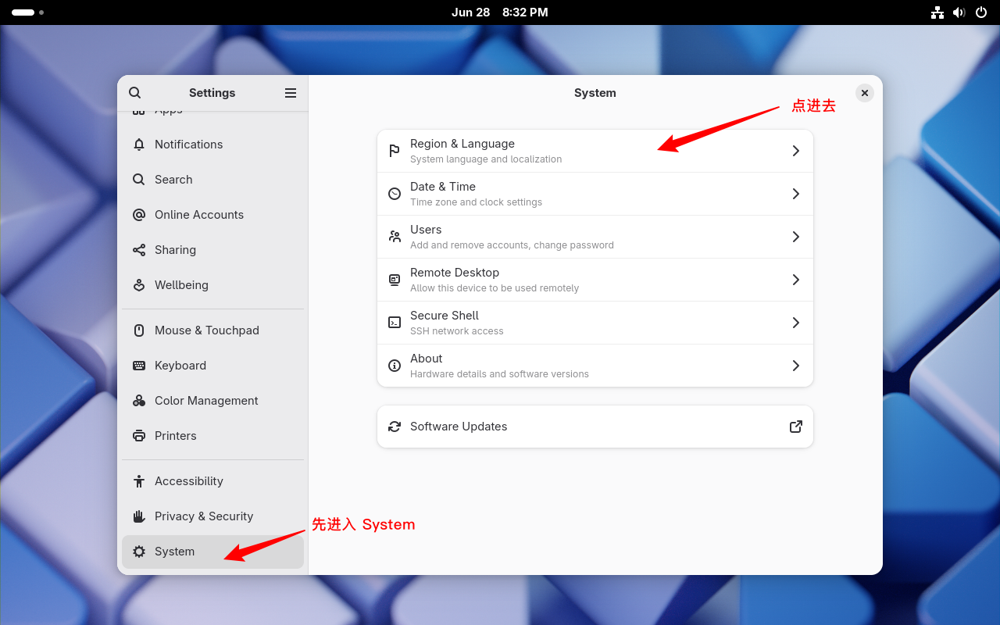
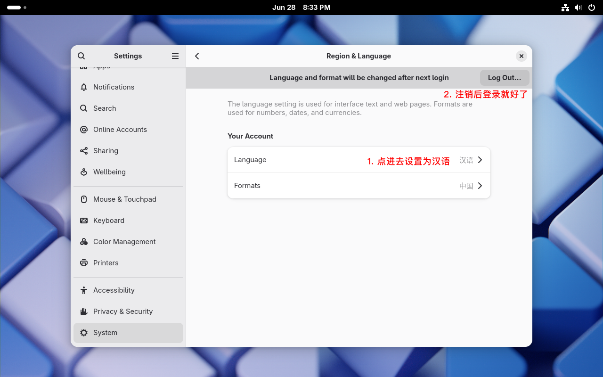
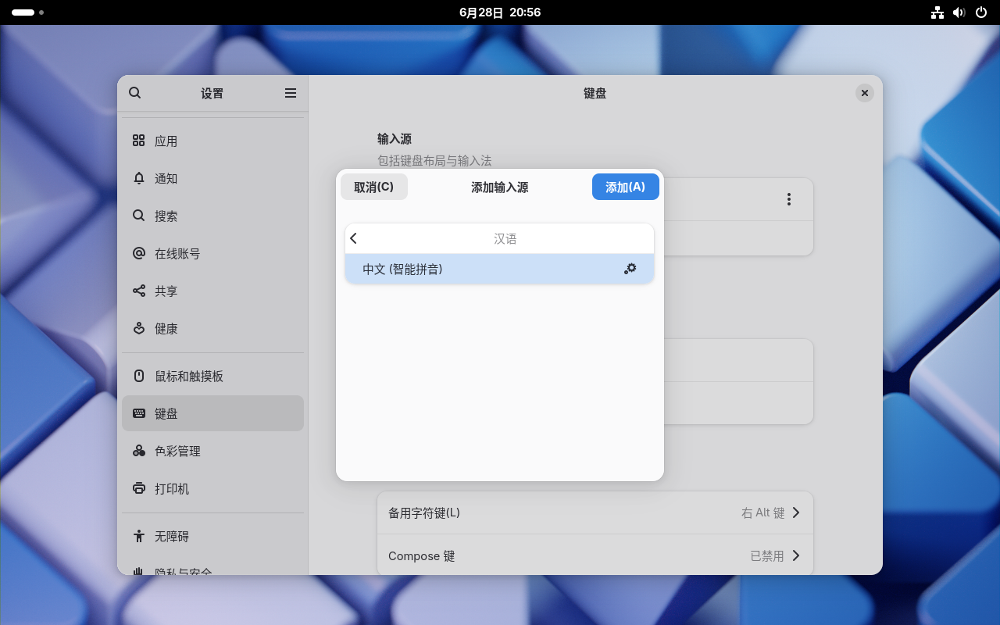
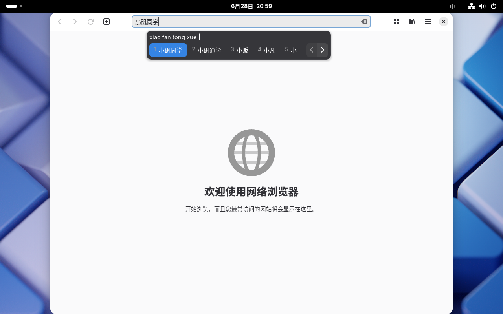

## 安装 Vim

在终端输入

```
sudo pacman -S vim
```

以安装 `Vim`。

## 安装 yay

编辑 `/etc/pacman.conf` 文件

```
sudo vim /etc/pacman.conf
```

在 `/etc/pacman.conf` 文件末尾添加以下几行：

```
[archlinuxcn]
Server = https://mirrors.tuna.tsinghua.edu.cn/archlinuxcn/$arch
Server = https://mirrors.aliyun.com/archlinuxcn/$arch
Server = https://mirrors.ustc.edu.cn/archlinuxcn/$arch
```

（以上三个镜像任选其一或都选）

接着，在终端输入

```
pacman -Sy archlinuxcn-keyring
pacman -S yay
```

即可完成 `yay` 的安装。

## 安装桌面环境

### GNOME

在终端输入

```
sudo pacman -S gnome gnome-tweak-tool
```

以安装 `GNOME` 桌面环境。

在终端输入

```
systemctl enable gdm.service
systemctl start gdm.service
```

以启动 `GNOME` 桌面环境。

## 安装浏览器

### Firefox

在终端输入

```
sudo pacman -S firefox
```

以安装 `Firefox` 浏览器。

### Google Chrome

在终端输入

```
yay -S google-chrome
```

以安装 `Google Chrome` 浏览器。

## 汉化及中文输入法

### 汉化

编辑 `/etc/locale.gen` 文件，将 `zh_CN.UTF-8 UTF-8` 前面的 `#` 去掉，保存并退出。

```
sudo vim /etc/locale.gen
```

接着执行

```
sudo locale-gen
```

然后在终端输入

```
sudo pacman -S noto-fonts noto-fonts-cjk noto-fonts-extra noto-fonts-emoji ttf-dejavu ttf-liberation
```

以安装中文字体。

切换语言步骤：`Settings` > `System` > `Region & Language`（请按图示内容操作）





### 中文输入法

#### IBus

在终端输入

```
sudo pacman -S ibus ibus-libpinyin
```

以安装 `IBus` 和中文引擎。

编辑 `$HOME/.bashrc` 配置环境变量，添加

```
sudo vim $HOME/.bashrc
```

```
export GTK_IM_MODULE=ibus
export XMODIFIERS=@im=ibus
export QT_IM_MODULE=ibus
```

然后执行

```
ibus-daemon -x -d
ibus-setup
```

自行配置你的输入法。

添加输入法步骤：设置 > 键盘 > 添加输入源 > 汉语 > 中文（智能拼音） > 添加 （请按图示内容操作）



可以把默认的 `英语（美国）` 删掉。


现在，我们可以愉快的打字了。



## 安装 Oh My Zsh （可选）

在终端输入

```
sudo pacman -S curl
```

以安装 `curl`。

在终端输入

```
sh -c "$(curl -fsSL https://raw.githubusercontent.com/ohmyzsh/ohmyzsh/master/tools/install.sh)"
```

或者

```
sh -c "$(curl -fsSL https://install.ohmyz.sh/)"
```

以安装 `Oh My Zsh`。
