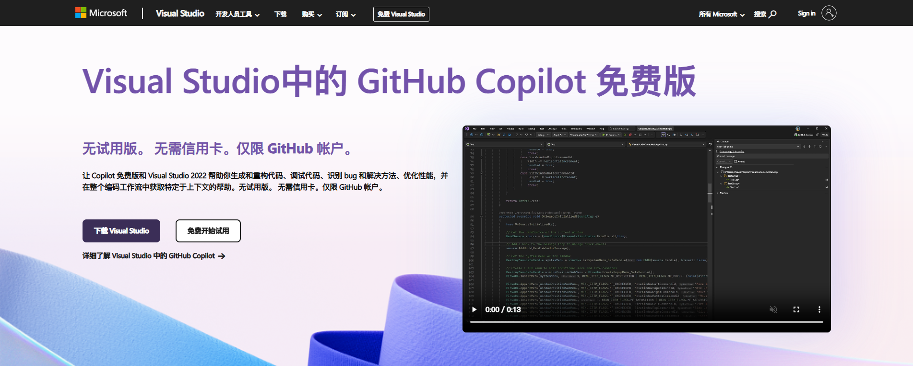
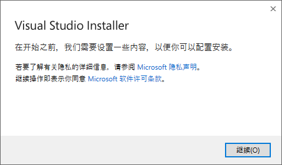
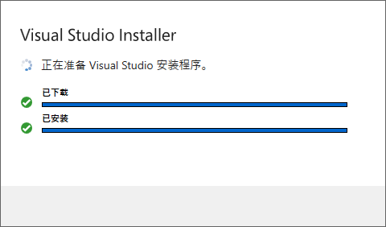
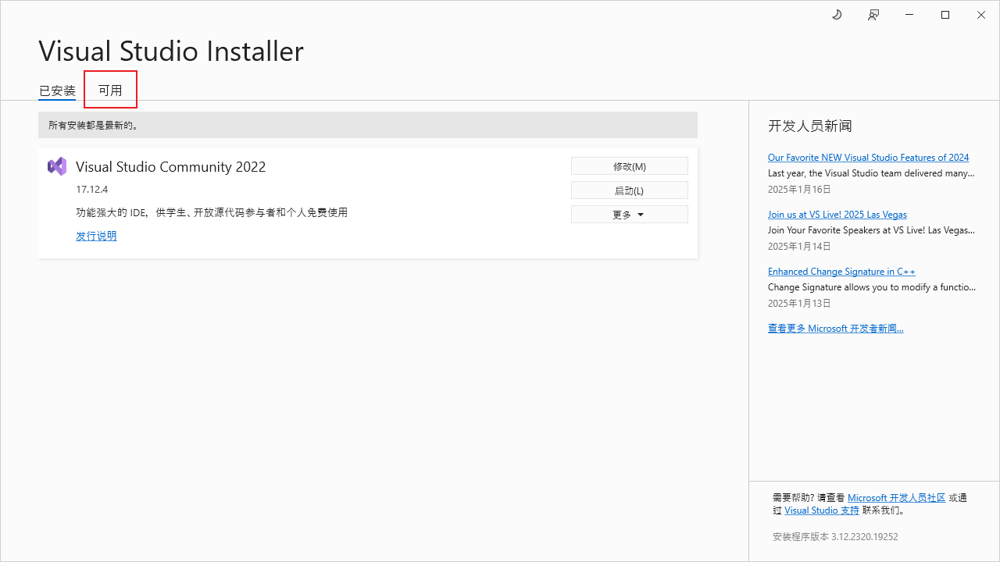
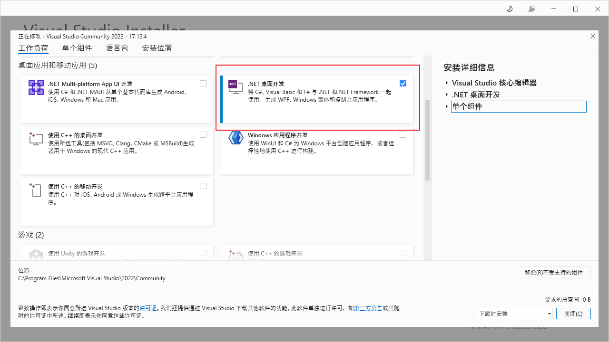
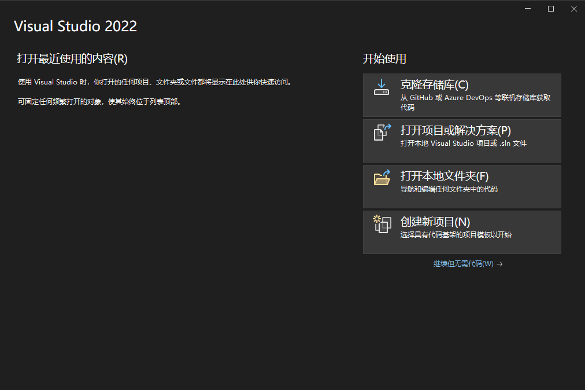
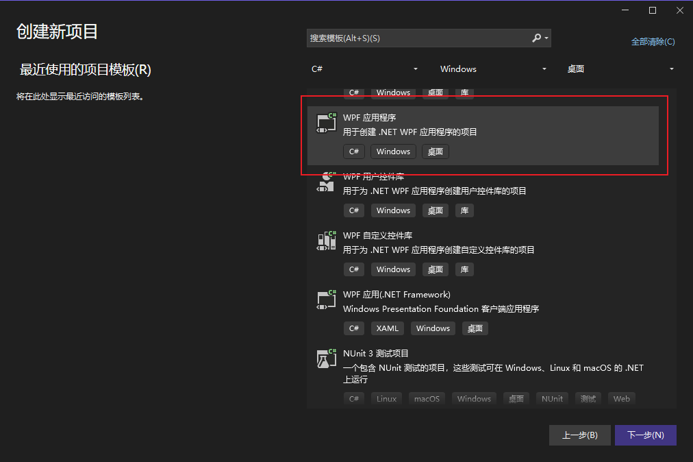
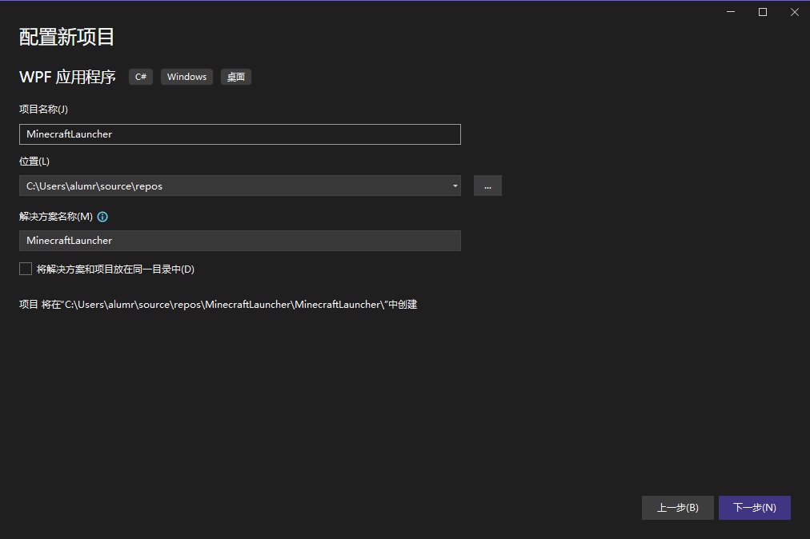
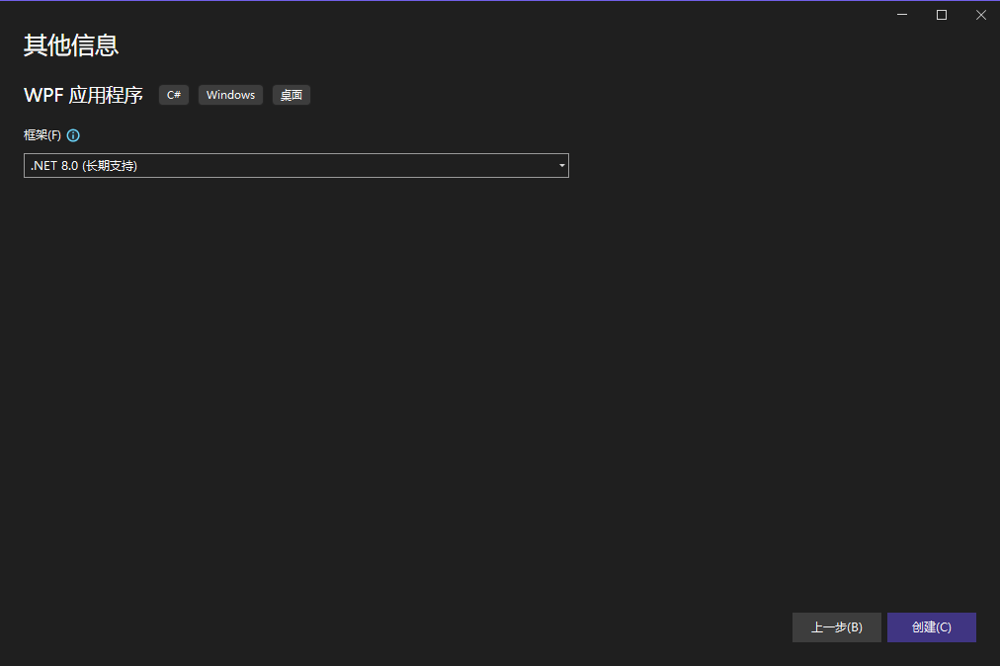
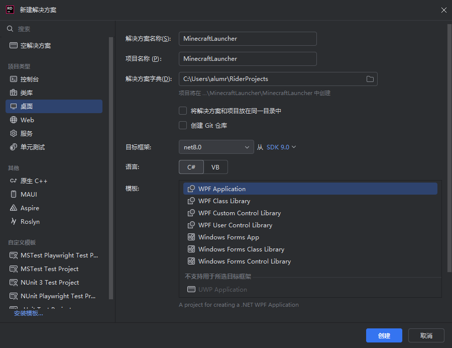

<base target="_blank">

## 安装 IDE

### Visual Studio

打开 [Visual Studio 官网](https://visualstudio.microsoft.com/)，点击“下载 Visual Studio”。

打开下载的安装程序，点击“继续”，等待安装完成。

在“可用”页面找到“Visual Studio Community 2022”并安装。

接着点击“修改”，在弹出的窗口中选择“.NET 桌面开发”并安装。

### JetBrains Rider

**（建议安装 JetBrains Rider 之前先安装 Visual Studio）**

打开 [JetBrains Rider 官网](https://www.jetbrains.com.cn/rider/)，点击“下载”。

**安装过程略……**

## 创建项目

### Visual Studio

打开 Visual Studio，点击“创建新项目”。

选择“WPF 应用程序”并点击下一步。

为自己的项目取名。

框架选择“.Net 8.0”并点击创建

### JetBrains Rider

打开 JetBrains Rider，点击“新建解决方案”，再按照图片上的操作。

## GitHub 储存库

::github{repo="alumr/MinecraftLauncher.Example"}
