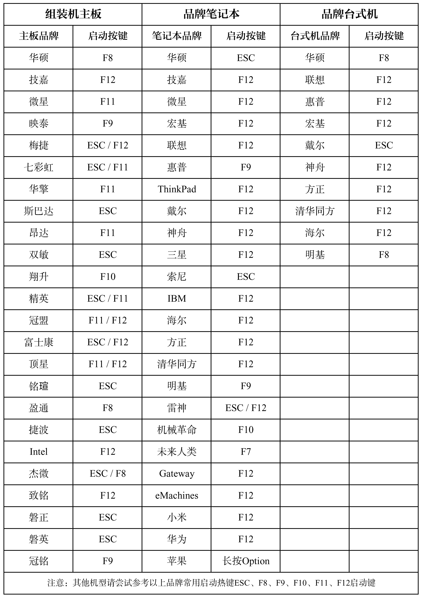

<base target="_blank">

<div align="center">

## Arch Linux 简介

</div>

‌&#12288;&#12288;[Arch Linux](https://archlinux.org/) (/ɑːrtʃ/)是一个独立开发的 [x86-64](https://baike.baidu.com/item/X86-64/1352293) 架构通用 [GNU/Linux](https://baike.baidu.com/item/GNU) 发行版，它致力于通过滚动更新来提供大多数软件的最新稳定版本。默认安装是一个最小的基本系统，由用户自行添加需要的软件。Arch Linux 使用 [pacman](https://baike.baidu.com/item/pacman) 作为包管理器。Arch Linux 采用滚动更新。Arch Linux 努力维护其软件的最新稳定版本，除非需要合理地避免系统包损坏。Arch Linux 以社区 [Wiki](https://baike.baidu.com/item/%E7%BB%B4%E5%9F%BA/10340758) 的形式提供文档，称为 [ArchWiki](https://wiki.archlinux.org/)。**（摘自 [Wikipedia](https://zh.wikipedia.org/wiki/Arch_Linux)）**

## 视频教程

<iframe width="100%" height="480" src="//player.bilibili.com/player.html?isOutside=true&aid=114755788409861&bvid=BV18uK6zcEur&cid=30730028497&p=1" scrolling="no" border="0" frameborder="no" framespacing="0" allowfullscreen="true"></iframe>

## 准备工作

### 下载 Arch Linux 镜像

打开[Arch Linux 官网的下载页](https://archlinux.org/download/)往下滑，选择一个镜像站。（这里以[清华源](https://mirrors.tuna.tsinghua.edu.cn/archlinux/iso/2025.06.01/)为例）

单击镜像触发下载


### 烧录 Arch Linux 镜像

#### 使用 [balenaEtcher](https://etcher.balena.io/)（推荐）

请按图示内容操作

1. 选择下载好的镜像文件。

2. 选择要烧录的 U 盘。（已经自动选好了）

3. 直接烧录。


#### 使用 [Rufus](https://rufus.ie/)

请按图示内容操作：

1. 选择要烧录的 U 盘。

2. 选择下载好的镜像文件。

3. 直接点击开始。（其他选项默认）


## 安装 Arch Linux

### 启动 U 盘

1. 先将电脑关机后插入烧录好的 U 盘，然后开机进入 BIOS。（一般 F2、F12、Delete、Esc 等都可以进入 BIOS，具体可以看下表）
   

2. 选择自己的 U 盘，等待出现图形化界面。

3. 选择第一项。
   

### 安装 Arch Linux 前的准备工作 （使用虚拟机演示）

1. 先联网（自己查阅资料，这里不作演示）。

2. 更换镜像源（这里以清华源为例），在命令行输入

```
nano /etc/pacman.d/mirrorlist
```


3. 在那一堆 `Server` 上添一行

```
Server = https://mirrors.tuna.tsinghua.edu.cn/archlinux/$repo/os/$arch
```

**为什么要在上面添而不是在下面添？** 是因为 Pacman 以 mirrorlist 中 Server 的顺序作为优先级，因此添加镜像需要在文件的最顶端添加。（摘自 https://mirrors.tuna.tsinghua.edu.cn/help/archlinux/ ）


然后按 `Ctrl+O`（是英文字母 O 不是阿拉伯数字 0！！！）再按 `Enter` 保存，按 `Ctrl+X` 退出。接着输入

```
pacman -Sy
```

测试一下是否换源成功。（是不是速度很快）

### 安装程序的配置（未提到的配置都默认）

#### 进入安装程序

在命令行输入

```
archinstall
```

以进入安装程序。

#### 换源

进入 `Mirrors and repositories` 进入第一项等待一会儿出现一个列表，按空格选中`China`。


再选中 `Back` 返回。

#### 分区

进入 `Disk configuration`

默认有三个选项，说人话分别就是 `使用安装程序自动分区` `自己用安装程序分区` `使用已经分好了的区`。


想手动分区的自己查资料，我选择自动分区。（格式选择 `ext4` ）

#### 选择引导加载程序

进入 `Bootloader`

默认选择[GRUB](https://baike.baidu.com/item/GRUB/4072057)。

#### 设置主机名

进入 `Hostname`

设置自己想要的名称，回车设置完成。


#### 设置 root 用户的密码

进入 `Root password`

输入两遍密码，回车设置完成。

#### 创建用户

进入 `User account`

进入第一项，先输入用户名再输入两遍密码，完毕后问你这个用户应不应该成为超级用户，在 `Yes` 选项上回车。


然后选择 `Confirm and exit` 并回车。


#### 选择桌面环境（并不建议在此时选择，后面安装时可能会报错）

进入 `Profile`，回车 `Type` 再回车 `Desktop` 选择自己喜欢的桌面环境后回车。（我选择[GNOME](https://www.gnome.org/)）


还可以选择显卡驱动，一般默认就行了。

#### 选择内核

默认选 `linux`，我选择 `linux-zen`，各个内核的区别如下：

| 内核名称       | 区别     |
| -------------- | -------- |
| linux          | 最新     |
| linux-hardened | 最安全   |
| linux-lts      | 长期支持 |
| linux-zen      | 性能最强 |


#### 网络配置

进入 `Network configuration`，选择 `Use NetworkManager`。


#### 选择时区

进入 `Timezone`，输入 `/Shanghai` 快速查找，选中 `Asia/Shanghai` 并回车。


#### 开始安装

大功告成，选择 `Install` 回车，问你要不要继续，选中 `Yes` 并回车即可开始安装。

**温馨提示：** 如有报错请多试几次。


## 常见问题

### 安装桌面环境（如 GNOME、KDE）时报错


**解决方法：** 安装完成后重启登录自己的账户，在命令行输入

```
sudo pacman -S gnome gnome-tweaks
```

等待安装完成。

接着输入

```
sudo systemctl enable gdm.service
sudo systemctl start gdm.service
```

即可启动图形化界面。

（KDE 请自行查阅资料）
